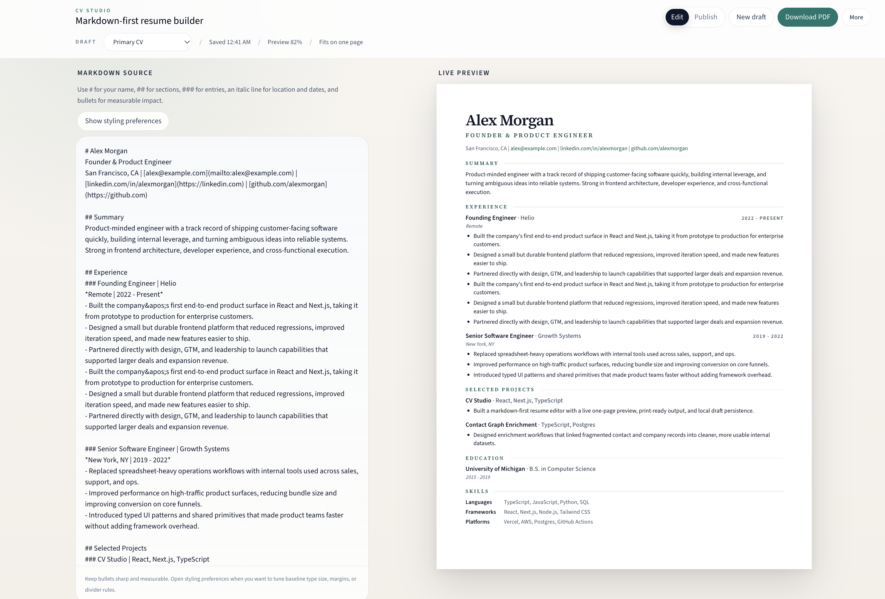
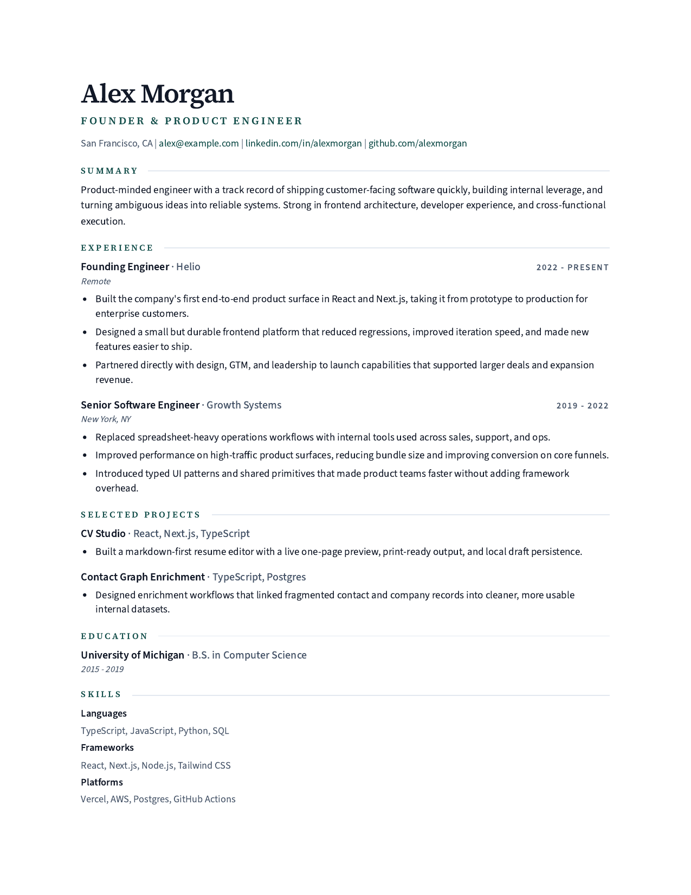

# Tiny CV

Tiny CV is an open-source, markdown-first resume builder that keeps your resume on one printable page.

Write in markdown, tune the styling with a few safe controls, preview the result on a real sheet of paper, and publish a clean public link when it is ready.

It also ships with a developer platform:

- REST API under `/api/v1`
- Remote MCP endpoint under `/api/v1/mcp`
- Project API keys for agents and third-party products
- Experimental no-account x402/MPP Agent Finish endpoints for one-off agent calls
- Markdown-canonical resume creation with optional structured JSON input
- Explicit draft -> publish flow
- Async PDF jobs
- One-time edit claim links for handing a draft back to a user

Live app: https://cvstudio-brown.vercel.app



## Why it feels different

Most resume tools are either:

- rigid form builders
- generic rich text editors
- template marketplaces with too many knobs and not enough structure

Tiny CV is built around a simpler model:

- markdown is the source of truth
- the preview lives on fixed paper dimensions
- fitting to one page is automatic
- the published version stays focused on the resume itself

It is designed for people who would rather edit a document than fight a WYSIWYG.

## What it does

- Markdown-first editing with a live paper preview
- One-page fit using Pretext-assisted estimation plus DOM verification
- Letter and legal page support
- Style presets for different resume moods without breaking printability
- PDF export from the browser print flow
- Server-backed anonymous workspaces, so drafts survive refreshes and browser back
- Public share links and private edit links
- Resume templates for engineers, designers, sales roles, and founders
- Mobile editing and mobile resume viewing that are adapted for smaller screens
- Developer API and MCP tools for agent-created resumes
- Optional accounts for claiming anonymous drafts across browsers

## Screenshots

### Editor


### Print output



## How it works

Tiny CV keeps three concerns separate:

1. Content
   The resume body is plain markdown.
2. Presentation
   Fonts, dividers, density, paper size, and margins live in frontmatter and UI controls.
3. Fit
   The app estimates scale, measures the real DOM, and adjusts until the resume fits the printable area.

That separation is what keeps the editor, preview, PDF export, and shared page aligned.

## Hosted model

Tiny CV is now fully server-backed.

- Every browser gets an anonymous workspace via an `httpOnly` cookie
- Drafts live in the database, not `localStorage`
- `/studio/[resumeId]` is the editor route
- `/:slug` is the public published resume
- Private edit links can attach an existing resume back into the current workspace
- Signed-in users can claim an anonymous workspace and reopen owned drafts on another browser

For local development without a database, the app falls back to a file-backed store in `.data/hosted-resumes.json`.

## Accounts

Tiny CV uses Better Auth for the account layer.

- Auth route: `/api/auth/[...all]`
- Account dashboard: `/account`
- Workspace claim endpoint: `POST /api/account/claim-workspace`
- Account-owned CV library: `/cvs`
- Account-owned resume opener: `/cvs/:resumeId/open`

Email/password auth is enabled by default. Google and GitHub sign-in are enabled when their OAuth env vars are present.

## Developer platform

Tiny CV now has a project-authenticated API-first platform for agents and integrations.

The API surface has two intentionally different entry points:

- Bearer-token API keys are for developers and products that want durable projects, webhook identity, usage history, and repeat integrations.
- x402/MPP paid endpoints are for no-account agent execution when an autonomous agent needs to complete one paid task immediately.

Neither API path grants permanent premium URL ownership. The premium `name.tiny.cv` identity belongs to paid human plans.

### Core model

1. Validate markdown or structured JSON input.
2. Create a draft resume.
3. Publish the draft to get a public URL.
4. Request a PDF job if you need a file artifact.
5. Optionally request a one-time edit claim URL so the end user can keep editing in Tiny CV.

### Public endpoints

- `GET /agents`
- `GET /api/v1/templates`
- `GET /api/v1/templates/:key`
- `GET /api/v1/spec/markdown`
- `GET /api/v1/spec/json-schema`
- `GET /openapi.json`
- `GET /api/v1/openapi.json`
- `POST /api/v1/projects/bootstrap`
- `POST /api/v1/resumes/validate`
- `POST /api/v1/resumes`
- `GET /api/v1/resumes/:resume_id`
- `PATCH /api/v1/resumes/:resume_id`
- `POST /api/v1/resumes/:resume_id/publish`
- `POST /api/v1/resumes/:resume_id/pdf-jobs`
- `POST /api/v1/paid/agent-finish`
- `POST /api/v1/paid/resumes`
- `POST /api/v1/paid/resumes/:resume_id/pdf-jobs`
- `GET /api/v1/pdf-jobs/:job_id`
- `POST /api/v1/edit-claims/:claim_id/consume`
- `POST /api/v1/mcp`

### Operational endpoints

- `POST /api/v1/jobs/process`

This endpoint is for cron/worker execution, not public client use. Protect it with `TINYCV_WORKER_SECRET`.

### Auth

The developer API uses project-scoped bearer tokens:

```http
Authorization: Bearer tcv_live_xxxxxxxxx
Idempotency-Key: your-request-key
```

`Idempotency-Key` is required for draft create, draft update, publish, and PDF job creation.
Rate-limited responses return `429` with a `Retry-After` header.

Create a project and first API key with:

```bash
curl -X POST http://localhost:3000/api/v1/projects/bootstrap \
  -H "Content-Type: application/json" \
  -H "x-tinycv-bootstrap-secret: $TINYCV_PLATFORM_BOOTSTRAP_SECRET" \
  -d '{"name":"My Agent"}'
```

### Machine payments

Tiny CV also exposes an experimental no-account paid path for agents. This is best thought of as Agent Finish: the agent brings resume content, Tiny CV turns it into a claimable hosted artifact.

- Agent guide: `https://tiny.cv/agents`
- `POST /api/v1/paid/agent-finish` creates and publishes a standard hosted resume, returns a claimable edit link, queues a PDF job, and returns a payment receipt. Default price: `$1.00`.
- `POST /api/v1/paid/resumes` creates a resume from markdown or JSON, publishes it immediately, and returns the public URL. Default price: `$0.25`.
- `POST /api/v1/paid/resumes/:resume_id/pdf-jobs` queues a PDF job for a paid, published resume. Default price: `$0.50`.

All paid machine routes require `Idempotency-Key`, validate request bodies before issuing payment challenges, and support x402 plus MPP. A first unpaid request returns `402` with x402 `PAYMENT-REQUIRED`, MPP `WWW-Authenticate: Payment`, and `Cache-Control: no-store`; retry with the protocol-specific payment header.

Machine-payment outputs use standard Tiny CV public URLs and claim links. They do not reserve premium `*.tiny.cv` names, do not grant Pro or Founder Pass entitlements, and do not support paid webhooks.

Discovery is available at root `/openapi.json` for AgentCash and MPPScan, while `/api/v1/openapi.json` remains as the versioned alias:

```bash
npx -y @agentcash/discovery@latest discover https://your-origin.com
npx -y @agentcash/discovery@latest check https://your-origin.com/api/v1/paid/agent-finish
npx -y @agentcash/discovery@latest check https://your-origin.com/api/v1/paid/resumes
```

Machine payments are disabled by default and do not affect Stripe billing, Pro entitlements, bearer-token endpoints, or MCP tools.

### MCP

Tiny CV exposes a remote MCP server over HTTP JSON-RPC at `/api/v1/mcp`.

Available tools include:

- `tinycv_list_templates`
- `tinycv_get_template`
- `tinycv_get_markdown_guide`
- `tinycv_get_json_schema`
- `tinycv_validate_resume`
- `tinycv_create_resume_draft`
- `tinycv_update_resume_draft`
- `tinycv_publish_resume`
- `tinycv_request_pdf`
- `tinycv_get_resume_status`
- `tinycv_get_pdf_job_status`

Developer-facing docs are available at `/developers`.

## Resume format

The core markdown shape is intentionally small:

```md
# Your Name
Headline
City, ST | [email@example.com](mailto:email@example.com) | [linkedin.com/in/you](https://linkedin.com)

## Summary
Short summary paragraph.

## Experience
### Staff Software Engineer | Example Company
*Remote | 2022 - Present*
- Shipped measurable result
- Improved something important

## Projects
### Tiny CV | React, Next.js, TypeScript
- Built a markdown-first resume editor with one-page preview and PDF export.
```

Optional style preferences are stored in frontmatter:

```md
---
stylePreset: technical
accentTone: forest
density: compact
headerAlignment: left
pageMargin: 0.9
pageSize: letter
showHeaderDivider: false
showSectionDivider: true
---
```

## Local development

```bash
pnpm install
pnpm dev
```

Open `http://localhost:3000`.

If you want a clean dev restart:

```bash
pnpm dev:restart
```

## Environment

Create `.env.local` only if you want a real database in development:

```bash
DATABASE_URL=postgresql://...
TINYCV_EDITOR_SECRET=change-me
TINYCV_PLATFORM_SECRET=replace-with-at-least-32-random-characters
TINYCV_PLATFORM_BOOTSTRAP_SECRET=change-me
TINYCV_RUNTIME_SCHEMA_SYNC=false
BETTER_AUTH_SECRET=change-me
BETTER_AUTH_URL=http://localhost:3000
TINYCV_MACHINE_PAYMENTS_ENABLED=false
```

Without `DATABASE_URL`, Tiny CV uses a local file-backed store for development.
The developer platform requires `DATABASE_URL`.

Run migrations before enabling the developer API in production:

```bash
pnpm db:migrate
```

Runtime schema sync is available for local development, but production should run explicit migrations instead.

To enable machine payments, set `TINYCV_MACHINE_PAYMENTS_ENABLED=true` plus real x402 wallet and MPP Tempo configuration. Production readiness fails if this feature is enabled with missing secrets, placeholder addresses, testnet defaults, or runtime schema sync.

Before deploying, verify production environment readiness:

```bash
pnpm check:prod
```

The full production checklist lives in [docs/production-launch-checklist.md](docs/production-launch-checklist.md).

PDF generation and webhook delivery are durable jobs. PDF jobs render the published resume's `?print=1` view in Chromium, so the exported file uses the same React/CSS as the public page. Configure one of:

- `TINYCV_BROWSER_WS_ENDPOINT` for Browserless or another CDP-compatible browser service
- `TINYCV_CHROME_EXECUTABLE_PATH` for a local/dedicated Chrome binary

Also set `TINYCV_APP_URL` to the public app origin so the worker can load published resume URLs.

On Vercel, configure a cron or scheduled worker to call:

```bash
curl -X POST https://your-domain.com/api/v1/jobs/process \
  -H "Authorization: Bearer $TINYCV_WORKER_SECRET" \
  -H "Content-Type: application/json" \
  -d '{"pdf_job_limit":1,"webhook_limit":10}'
```

Vercel Cron sends `GET` requests, so the same endpoint also supports cron configuration. The repo uses a conservative once-daily cron so Hobby deployments do not fail:

```json
{
  "crons": [
    {
      "path": "/api/v1/jobs/process",
      "schedule": "0 8 * * *"
    }
  ]
}
```

On Vercel Pro, change the schedule to `*/5 * * * *` if you want faster job recovery.

Set `CRON_SECRET` or `TINYCV_WORKER_SECRET` in Vercel to protect the cron invocation.

The app also schedules best-effort background processing after create/update/publish/PDF requests, but the worker endpoint is the recovery path.

## Verification

```bash
pnpm test
pnpm lint
pnpm check:design
pnpm build
```

`pnpm check:design` runs automatically as part of `pnpm lint`; `pnpm build` runs the all-files version before compiling. The check fails dark brand-green buttons that do not use the shared primary button class or `!text-white`.

To verify the browser-backed PDF path end to end, start the app with a database, `TINYCV_APP_URL`, and worker/browser configuration, then run:

```bash
pnpm test:account
pnpm test:pdf
```

`test:account` creates an anonymous workspace draft, signs up a test account, claims the workspace, opens the claimed resume through the account route, and verifies Studio renders the expected template content.

`test:pdf` creates a draft through `/api/v1`, publishes it, queues a PDF job, polls for completion, downloads the artifact, and asserts that the generated PDF is a valid one-page Letter document. It writes the downloaded file and a JSON report to `.data/`.

For local visual parity checks, install Poppler and run:

```bash
pnpm test:pdf:visual
```

This renders the same public `?print=1` page directly, rasterizes both PDFs, and writes expected, actual, and diff PNGs to `.data/`.

## Stack

- Next.js 16
- React 19
- Tailwind CSS 4
- Postgres
- `@chenglou/pretext`
- `react-markdown`
- `remark-gfm`
- Vitest

## Roadmap

- Full account system on top of the current anonymous workspace model
- Better template previews
- More share-page customization
- Cleaner import/export flows for existing resumes

## License

MIT
