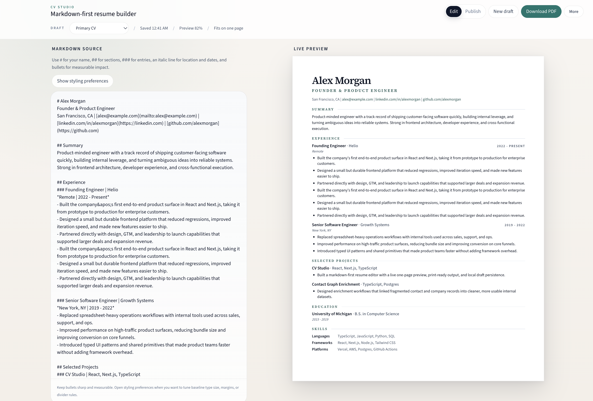

# Tiny CV

Tiny CV is an open-core, markdown-first resume builder for people who want one clean printable page, a shareable public URL, and an editing model that stays close to the document itself.

This repository contains the core Tiny CV app:

- the web editor and public resume pages
- the hosted draft and publish flows
- the developer API under `/api/v1`
- the remote MCP endpoint under `/api/v1/mcp`
- optional browser-backed PDF and publish-fit jobs



## Paths

- Use the product: write and publish one-page resumes with a live paper preview.
- Self-host the core: run Tiny CV in file-backed local mode or with a Postgres database.
- Build integrations: create drafts, publish resumes, and request PDFs over REST or MCP.

## Why it feels different

Most resume tools are either rigid form builders, generic rich text editors, or template marketplaces with too many knobs.

Tiny CV is built around a simpler model:

- markdown is the source of truth
- the preview lives on fixed paper dimensions
- fitting to one page is automatic
- the published version stays focused on the resume itself

## What ships in this repo

- Markdown-first editing with a live paper preview
- One-page fit using Pretext-assisted estimation plus DOM verification
- Letter and legal page support
- Public share links and private edit links
- Resume templates for engineers, designers, sales roles, and founders
- Mobile editing and mobile resume viewing
- Optional accounts for claiming anonymous drafts across browsers
- Project-authenticated API keys for durable integrations
- Optional x402/MPP endpoints for one-off paid agent execution

## Open-Core Boundary

This repo is intended to be publishable as an open-core app.

- The open-source core is the editor, renderer, templates, draft/publish model, API, MCP server, and self-host path.
- Optional commercial layers include premium branding removal, paid plans, premium subdomain ownership, and hosted-service operations.
- Some optional commercial code paths remain in the repo so the hosted product and the public codebase stay close, but self-hosters can ignore those integrations unless they want them.

## Support Matrix

| Mode | What you get | Requires | Intended use |
| --- | --- | --- | --- |
| File-backed local mode | Editor, preview, templates, local publishing flows | Nothing beyond Node and pnpm | Fast local development and simple self-hosting |
| Database-backed mode | Durable workspaces, accounts, account-owned resumes, full developer API | Postgres | Serious self-hosting and production deployments |
| Browser-backed jobs | Chromium-measured publish fit, async PDF jobs, and per-resume social cards | `TINYCV_BROWSER_WS_ENDPOINT` or `TINYCV_CHROME_EXECUTABLE_PATH` | Production PDF/export parity |
| Billing and machine payments | Stripe checkout, premium entitlements, x402/MPP paid endpoints | Extra provider credentials | Optional commercial add-ons |

## Quick Start

```bash
pnpm install
pnpm dev
```

Open `http://localhost:3000`.

No `.env.local` file is required for the core experience. Without `DATABASE_URL`, Tiny CV falls back to a file-backed local store at `.data/hosted-resumes.json`.

If you want a clean dev restart:

```bash
pnpm dev:restart
```

## Local Development

### Core local mode

This is the easiest way to evaluate the project.

```bash
pnpm install
pnpm dev
```

You get the editor, templates, preview, and file-backed draft persistence without configuring a database, billing, OAuth, or background browser workers.

### Full-stack local mode

If you want accounts, the durable API, or production-like storage, copy the example env file and fill in the required values:

```bash
cp .env.example .env.local
```

Minimum values for a database-backed local setup:

```bash
DATABASE_URL=postgresql://...
TINYCV_EDITOR_SECRET=replace-with-a-random-local-secret
TINYCV_PLATFORM_SECRET=replace-with-at-least-32-random-characters
TINYCV_PLATFORM_BOOTSTRAP_SECRET=replace-with-a-random-local-secret
BETTER_AUTH_SECRET=replace-with-at-least-32-random-characters
TINYCV_APP_URL=http://localhost:3000
BETTER_AUTH_URL=http://localhost:3000
TINYCV_RUNTIME_SCHEMA_SYNC=false
```

Run migrations before enabling database-backed flows:

```bash
pnpm db:migrate
```

Optional features such as OAuth, Stripe billing, and machine payments can stay unset until you actually need them.

## Security And Local Fallbacks

The example env file intentionally contains placeholders that are unsafe outside local development.

- Local development allows a few convenience fallbacks for auth, platform, and worker secrets so the repo is easy to boot on a fresh clone.
- Those fallbacks are development-only conveniences, not recommended configuration.
- Production deployments must set explicit secrets, disable placeholder values, and pass `pnpm check:prod`.
- If you expose `/api/v1/jobs/process`, protect it with `TINYCV_WORKER_SECRET` or `CRON_SECRET`.

## Resume Format

The core markdown shape is intentionally small:

```md
# Your Name
Headline
City, ST | [email@example.com](mailto:email@example.com) | [linkedin.com/in/you](https://linkedin.com)

## Summary
Short summary paragraph.

## Experience
### Staff Software Engineer | Example Company
*Remote | 2022 - Present*
- Shipped measurable result
- Improved something important

## Projects
### Tiny CV | React, Next.js, TypeScript
- Built a markdown-first resume editor with one-page preview and PDF export.
```

Optional style preferences live in frontmatter:

```md
---
stylePreset: technical
accentTone: forest
density: compact
headerAlignment: left
pageMargin: 0.9
pageSize: letter
showHeaderDivider: false
showSectionDivider: true
---
```

## Developer Platform

Tiny CV exposes two integration surfaces:

- REST API under `/api/v1`
- remote MCP server over HTTP JSON-RPC at `/api/v1/mcp`

Common public endpoints:

- `GET /api/v1/templates`
- `GET /api/v1/spec/markdown`
- `GET /api/v1/spec/json-schema`
- `POST /api/v1/resumes/validate`
- `POST /api/v1/resumes`
- `POST /api/v1/resumes/:resume_id/publish`
- `POST /api/v1/resumes/:resume_id/pdf-jobs`
- `POST /api/v1/mcp`

Optional paid agent endpoints also exist under `/api/v1/paid`. They are off by default and do not need to be configured for normal self-hosting.

## Deployment

For production setup, environment variables, workers, and hardening steps, see [docs/production-launch-checklist.md](docs/production-launch-checklist.md).

High-level deployment requirements:

- Postgres for durable production storage
- explicit secrets for editor, platform, auth, and worker flows
- Chromium access for browser-measured publish fit, PDF jobs, and social cards
- a scheduled job or worker invocation for `/api/v1/jobs/process`

## Verification

Core checks:

```bash
pnpm test
pnpm lint
pnpm build
```

Additional infra-backed checks:

```bash
pnpm test:account
pnpm test:api-fit
pnpm test:pdf
```

`test:account`, `test:api-fit`, and `test:pdf` require the corresponding database, browser, and app configuration to be present.

## Contributing

See [CONTRIBUTING.md](CONTRIBUTING.md), [SECURITY.md](SECURITY.md), and [CODE_OF_CONDUCT.md](CODE_OF_CONDUCT.md).

## Stack

- Next.js 16
- React 19
- Tailwind CSS 4
- Postgres
- `@chenglou/pretext`
- `react-markdown`
- `remark-gfm`
- Vitest

## License

MIT
